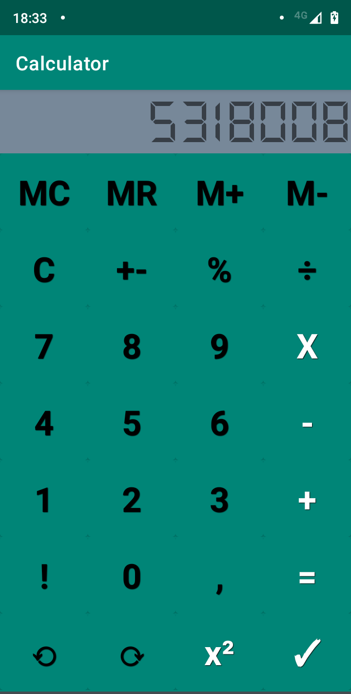

# CalculaTech

## Introduction ##

This app is a simple calculator, to do some simple arithmetics operations and some more advances ones.

The operations are:

* __C:__ Reset the number of the screen
* __+-:__ Convert the signal of the number
* __%:__ Calculates the percentage
* __÷:__ Simple division operation
* __X:__ Simple multiplication operation
* __-:__ Simple subtraction operation
* __+:__ Simple sum operation
* __=:__ Show on the screen the result of a binary operation
* __✓:__ Calculates the square root of a number
* __x²:__ Calculates the exponential of a number
* __⟲:__ Undo a operation
* __⟳:__ Redo a operation
* __!:__ Factorial operation, works well 'till arround 20-30, after that, the result can be out of bounds
* __M+:__ Insert the current number of the screen on the memory
* __MR:__ Show on the screen the number stores on the memory
* __M-:__ Removes the number stored on the memory
* __MC:__ Reset the memory

## Contributing ##

Is a small app, can have new features on the future, like the memory storage is only stored on the current session of the app, more advanceds operations
and fix any bug.
So feel free to contribute or talk about the app.
